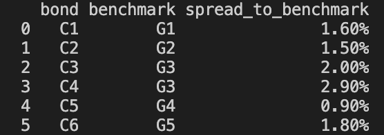

# Intro
The solution to both parts of the coding challenge is written in python. 
The input to both parts is a csv file. By making use of pandas library in python, the input data is loaded into a DataFrame for easy access to all data in the <ins>get_data()</ins> function.

 

# Spread Calculations (Challenges 1 & 2)

The function <ins>get_minPairs(CorpData,GovData)</ins> finds the closest government bond index for each corporate bond in terms of years and returns the result as a list of pairs of indices.

<ins>yield_spread(CorpData,GovData)</ins> calculates the yield spread to curve for each corporate bond and adds the result to a new Dataframe for better visualization of output.

<ins>spread_to_curve_calc(CorpData,GovData)</ins> uses python's scipy interpolate library to find the linear interpolation of the government yield regarding its terms. This function also uses the add_to_table2 helper function to save the results in a DataFrame, which it returns.

 

# Running the tests
For conveninece in testing, additional python files were added one for testing of part 1 and the other for part 2 of the challenge.  
The code can be tested by running the following command in the overbond folder. 
For Challenge 1:
>   python testPart1.py
 

For Challenge 2:
>   python testPart2.py

A sample input is available in the overbond folder.

 

# Sample Output 
Challenge 1:

----
Challenge 2:

# Given Additonal Time
I would:
- test my code against a wider range of data with more edge cases.
-  focus on optimizing the code for larger datasets.
- improve the format of the output for better visualization  